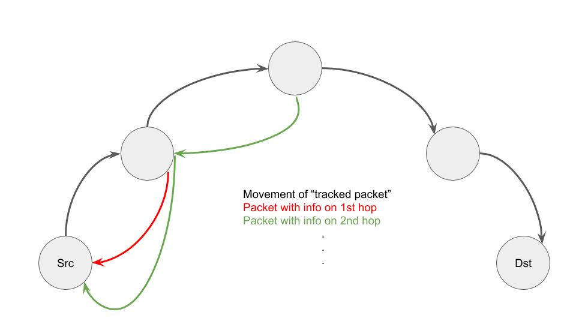

# Traceroute with Queue Depths


## Terminology
- "Tracked Packet" refers to a packet marked with custom IP protocol signifying to the router that it should respond to the sender with information about the 
- "Metadata Packet" refers to a packet which is sent from routers to the initial sender which contains data such as router name, hop number, queuing timestamp, and the depths of the queue at enqueue and dequeue of the "tracked packet."

## Description
A debugging application which traces the path of a packet and records the queue depth at the switches it visits.

## Router Design

The p4 source specification for a router given at `p4src/tracertqueuing.p4`  only requires a packet to be sent once through the network. This has the advantage of sending fewer packets, while also establishing continuity for the network state experienced by a packet. By this I mean that under the traceroute design, the queuing information for the second hop would be for the second packet which was routed through both the first and second hops.

During the parsing of a "tracked packet", the IP header protocol is changed to the traditional TCP/UDP protocols so that routing controls will not be affected. This change will later be reverted during deparsing.

The packet is cloned in the egress pipeline (so that it has access to queuing information). This cloned packet is transformed into a "metadata packet" by storing the information outlined in the Terminology section. Finally, the destination IP and source IP are swapped so that it will be routed back to the sender. As the "metadata packet" moves back through this backward routing, its hop number is incremented for each backwards hop.

As a "tracked packet" moves forward through each hop, each router will send a packet back to the sending program which aggregates the information and displays it to the user. If the hop is the final hop, it will also set a flag indicating that the packet has reached its final destination.

This process is summarized in the following graphic for the first two hops.



This design is somewhat complex but supports arbitrarily large networks as information about each hop is not embedded into the packet which is constrained by size.

## Controller Design
The only unique component of the controller is the code which sets the default in the switch name match table of the p4 router. More implementation details is given below in the Using this Tool section.

## Application Design

The program should be run in the shell of one of the hosts in the network and takes one command line argument: the destination host.

The program then sends a "tracked packet" to the destination host, waits for the minimum of some timeout or for a response packet to be received which indicates that the packet is from the final hop, and reorders the packet information based on the hop number within the packet and prints them to the users, including whether or not the final destination was reachable.

## Using this Tool

### Router and Controller

The P4 Router defined in this directory at `p4src/tracertqueuing.p4` contains an implementation of a router which contains all of the necessary components to respond to "tracked packets" and uses ECMP-based routing decisions based on five-tuples.

You should use this p4 code as a template for which you can substitute in other routing policies; however, an important thing to note is that any router with which you want to use this program and functionality must implement the destination type (distinguishing connections between switch-facing and host-facing) as this is how the router determines if it is the final hop.

Similarly, the controller code in this repository should also serve as a template which can be modified so long as the code which sets the default switch names and the destination types in the corresponding match tables in the router are maintained.

### Application
The use of the application is as follows:

```
$ mx <HOST_NAME> // to open shell in source host
$ ./tracertqueuing.py <DST_HOST_IP_ADDRESS>
```
